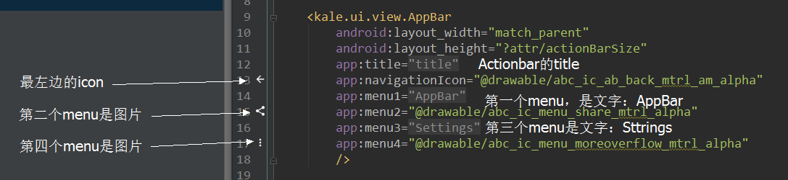
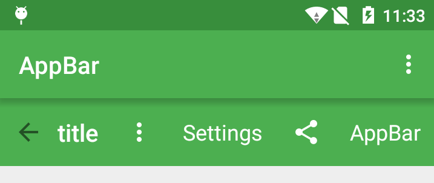

# AppBar
通过继承ToolBar制作的简单Actionbar。

### 示例   
编码：
  
结果：  
  

### 添加依赖

1.在项目外层的build.gradle中添加JitPack仓库

```  
repositories {
	maven {
		url "https://jitpack.io"
	}
}
```    
2.在用到的项目中添加依赖
  
compile 'com.github.tianzhijiexian:AppBar:[Last Version](https://github.com/tianzhijiexian/AppBar/releases)'    
  

### 思路  
Android的actionbar机制让我们需要定义各种style，而且actionbar内部的view都是不能直接获得的，在做一些效果的时候比较不方便。最关键的是actionbar的menu定义和初始化是在activity中的，个人认为xml文件中就应该能做好一切的ui，而activity中只是做UI和事件的连接工作。   
于是，我想自己定义一个actionbar。在做的时候发现自己定义一个actionbar是很困难的，无法照顾到所有需求，什么自动折叠menu这样的特殊操作比较难做。在综合考虑之下，我通过继承ToolBar的方式来做actionbar。  

这里分享几个感悟：  

**1. 为啥actionbar不是放在xml中，而是要用activity来设置呢？**  

 因为actionbar这个东西很多页面都需要引用，如果做成单个的控件，那么就需要重复引用多次，不方便。放在activity中的原因是可以将actionbar这种特殊的、在整个应用中样子都不太会变的view进行统一管理。但是不好之处就是需要各种style，而且比较难做动画效果。于是官方抛弃了actionbar，而是推出了toolbar。这样的好处就是可以自己灵活管理这个view，在现在这个actionbar都要很多动画的年代，老旧古板的actionbar必然被抛弃。  

**2. 为啥actionbar的menu要放在一个独立的xml中写？**  

   因为actionbar的menu样子都差不多，之前的设计方案是希望把这些样子基本一样的view做统一管理，一个style定义好了所有menu的样式。但是android又没有给view提供这样的机制，于是就建立了一个menu的xml来把这些menu不同的地方进行编写。至于样式和大小什么的，都不用管了，style文件会帮你搞定。这也是变和不变隔离的思想。但问题又来了，这样做的坏处就是写一个页面很痛苦，首先xml中不能预览actionbar，而且在activity中还需要set一下actionbar。想要写menu还得写一个xml文件，在activity中进行create。最终，写一个menu功能需要动三个文件，很麻烦，大大降低了编码的舒适感。  

### 使用方式    

**0. 混淆配置**   
> -keep class android.support.v7.widget.Toolbar {*;}

**1. 在主题中设置默认样式（一次设置就搞定）**
```XML   
	<!-- Base application theme. -->
    <style name="AppTheme" parent="Theme.AppCompat.Light.DarkActionBar">
        <!-- Customize your theme here. -->

	<!-- 支持toolbar -->
        <item name="windowActionBar">false</item>
        <item name="android:windowNoTitle">true</item>
        <item name="windowNoTitle">true</item>

        <!-- 默认是toolbar的背景色（也可以去toolbarStyle中配置android:background） -->
        <item name="colorPrimary">@color/color_primary_green</item>
        <!-- 默认是toolbar的title颜色（也可以去toolbarStyle中配置titleTextAppearance） -->
        <item name="android:textColorPrimary">@android:color/darker_gray</item>
        <!-- toolbar的样式 -->
        <item name="toolbarStyle">@style/Toolbar</item>
        <!-- toolbar上面的menu整体样式 -->
        <item name="toolbarNavigationButtonStyle">@style/Toolbar.Menu</item>
        <!-- toolbar上面的menu的样式 -->
        <item name="toolbarMenuTextStyle">@style/Toolbar.Menu.Text</item>
        <item name="toolbarMenuImageStyle">@style/Toolbar.Menu.Image</item>
    </style>
```  
这里的style都是采用的默认style，完全可以自己参考默认style进行定义。  

属性详解：  
https://github.com/tianzhijiexian/AppBar/blob/master/app/src/main/res/values/styles.xml

**2. 布局文件**  
```XML  
<kale.ui.view.AppBar
	android:id="@+id/app_bar"
	android:layout_width="match_parent"
	android:layout_height="?attr/actionBarSize"
	app:navigationIcon="@drawable/abc_ic_menu_moreoverflow_mtrl_alpha"
	app:title="@string/title"
	app:menu1="@string/app_name"
	app:menu2="@drawable/abc_ic_menu_share_mtrl_alpha"
	app:menu3="@string/action_settings"
	app:menu4="@drawable/abc_ab_share_pack_mtrl_alpha"
	app:menu5="@drawable/abc_dialog_material_background_dark"
	/>
```  

**3. java代码**   

```JAVA  
	AppBar appBar = (AppBar) findViewById(R.id.app_bar);
        
        appBar.getMenu01(); // 可以通过appbar来获得menu对象
        appBar.getTitleView();
        appBar.getNavButton();
        appBar.getSubtitleView();
        appBar.getLogoView();
        appBar.getCollapseButton();
        appBar.canFinishActivity(); // 调用此方法后，点击toolbar左边按钮会让activity finish
        // 还有各种toolbar本身的方法……
        
        View customMenu = appBar.getMenu03();
        ((TextView) customMenu.findViewById(R.id.menu_tv)).setText("kale");
```  

顺便附上android源码中toolbar的全部attr，以便于进行更加详细的设定：  
```XML
    <declare-styleable name="ToolBar">
        <attr name="titleTextAppearance" />
        <attr name="subtitleTextAppearance" />
        <attr name="title" />
        <attr name="subtitle" />
        <attr name="android:gravity" />
        <attr name="titleMargins" />
        <attr name="titleMarginStart" />
        <attr name="titleMarginEnd" />
        <attr name="titleMarginTop" />
        <attr name="titleMarginBottom" />
        <attr name="contentInsetStart" />
        <attr name="contentInsetEnd" />
        <attr name="contentInsetLeft" />
        <attr name="contentInsetRight" />
        <attr name="maxButtonHeight" />
        <attr name="collapseIcon" />
        <attr name="collapseContentDescription" />
        <attr name="popupTheme" />
        <attr name="navigationIcon" />
        <attr name="navigationContentDescription" />
        <attr name="android:minHeight" />
    </declare-styleable>  
```   

### 开发者


Jack Tony: <developer_kale@foxmail.com>  


### License

    Copyright 2015 Jack Tony

    Licensed under the Apache License, Version 2.0 (the "License");
    you may not use this file except in compliance with the License.
    You may obtain a copy of the License at

       http://www.apache.org/licenses/LICENSE-2.0

    Unless required by applicable law or agreed to in writing, software
    distributed under the License is distributed on an "AS IS" BASIS,
    WITHOUT WARRANTIES OR CONDITIONS OF ANY KIND, either express or implied.
    See the License for the specific language governing permissions and
    limitations under the License.
